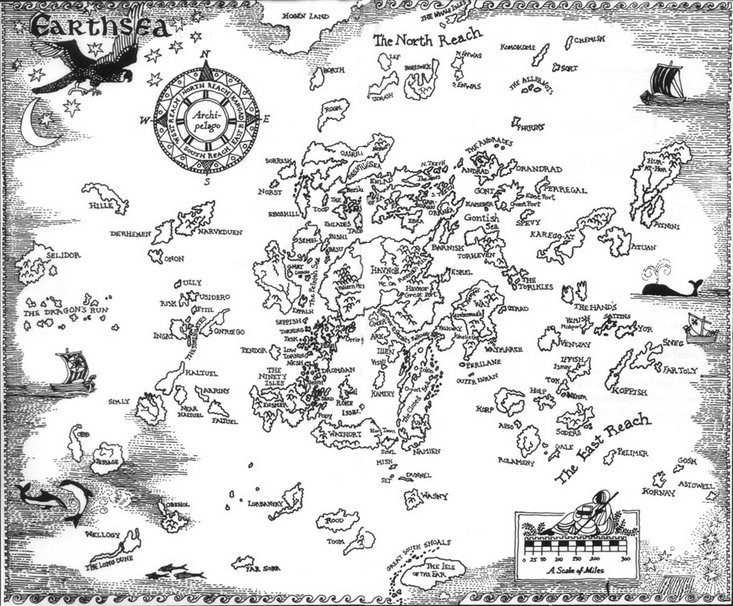

# Scuttlebutt Guide

_Looking to learn how to build in Scuttlebutt? There's currently no canonical resource, but here's a map of the known archipelago!_

Have you found an Uncharted Isle? We'd love to hear about it.

## Documentation

[scuttlebot.io](http://scuttlebot.io/) - has great details about sbot and ssb-client (and other modules)

[ssbc.github.io](https://ssbc.github.io/docs) - a predecessor to scuttlebutt.io, much of the same content, has some other tutorials

[pull-stream.github.io](https://pull-stream.github.io/) - a guide to the pull-stream ecosystem (scuttlebut uses pull-streams extensively)

[github.com/pull-stream/pull-stream-faq](https://github.com/pull-stream/pull-stream-faq) - a simple FAQ

## Tutorials

### Videos

Intro to Scuttlebutt
  - ssb-client - repo + video ([ssb](%DQVOkekw0Cx7bz0fcV8/WlWlBQHnpLw9LyYp7ctYC/0=.sha256) | [github](https://github.com/mixmix/ssb-client-intro)), learn how to connect to your databaseand do some streaming queries!

Into to Mutant
  - Part 1 - [video](https://www.youtube.com/watch?v=UcHNobDImK0), introduces observeables with `Value`, and `when`. Make a part of the page toggle dynamically
  - Part 2 - [video](https://www.youtube.com/watch?v=KYiTYUvX5JM), introduces `computed` which takes in multiple observeables and makes a new observeable, and `Struct` (kind a like an observeable object with pre-defined keys). I focus a bit of refactoring and moving code around to give you an idea of what's possible.

_Mutant is a client side reactive library which is all about mutating the DOM. It's used by Patchwork, Patchbay, Ticktack (and the underlying lib Patchcore)._

### Written

[github.com/don-smith/ssb-tutorial](https://github.com/don-smith/ssb-tutorial) - a command line intro that uses docker to spin up several sbots and get them talking to each other.

### Code snippets

[scuttlebot.io](http://scuttlebot.io/docs/basics/publish-a-message.html) - lots of code snippets, some background
  - [post a message](http://scuttlebot.io/docs/basics/publish-a-message.html)
  - [watch for new messages](http://scuttlebot.io/docs/advanced/watch-for-messages.html)
  - [publish a blob](http://scuttlebot.io/docs/advanced/publish-a-file.html) | [read a blob](http://scuttlebot.io/docs/advanced/read-a-file.html) (blobs are files / attachments)
  - many others

[ssbc.github.io/scuttlebot/](http://ssbc.github.io/scuttlebot/) - (see HowTo Guides down side) more detail, but an odler reference
  - [post a message](http://ssbc.github.io/docs/scuttlebot/howto-publish-a-post.html) (includes examples of mentioning, channels etc.)
  - [update your profile](http://ssbc.github.io/docs/scuttlebot/howto-update-your-profile.html)
  - [example of mentioning blobs in a post](http://ssbc.github.io/docs/scuttlebot/howto-publish-a-file.html)
  - [set up a Pub Server manually](http://ssbc.github.io/docs/scuttlebot/howto-setup-a-pub.html) (an old guide)

## Module guides

[scuttlebutt.nz/modules.html](https://www.scuttlebutt.nz/modules.html) - a great overview of modules organised by domain / stack-position

